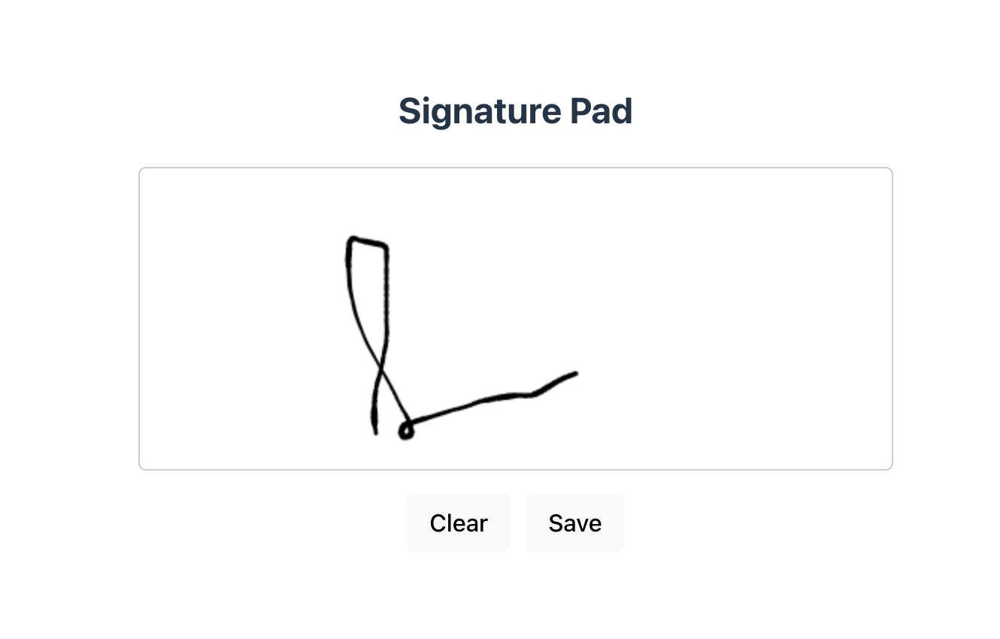

# React + Vite

A simple React application using Vite and the `react-signature-canvas` library for capturing digital signatures.

## Getting Started

1. Clone the repository:
   ```bash
   git clone https://github.com/hameed-fu/react-signature
   cd react-signature
## Project Preview

Here’s a preview of the signature canvas:
#### Example 1

#### Example 2
